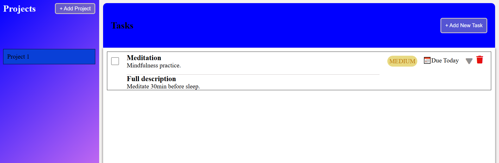

# TodoList-app

A small, single-page Todo List app built with vanilla JavaScript, bundled with Webpack. The app supports multiple projects, per-project tasks with priorities and due dates, and saves data in the browser's Local Storage.

## Features

- Create and manage multiple projects
- Add tasks to a project with: title, short description, full description, priority (HIGH / MEDIUM / LOW), and due date
- Task completion (checkbox) and delete tasks
- Tasks show a human-friendly due label 
- Project and task persistence using Local Storage
- Built with Webpack for development and production builds

## Tech stack

- Vanilla JavaScript (ES modules)
- CSS for styling
- Webpack (dev server + build)
- date-fns (for date calculations)

Dependencies are declared in `package.json`

## Quick start

Prerequisites: Node.js (16+) and npm.

1. Install dependencies

```powershell
npm install
```

2. Start development server (webpack-dev-server on port 3000)

```powershell
npm run start
```

The dev server will open the app in your default browser. The server writes files to disk (dist/) and watches `src/` for changes.

3. Build for production

```powershell
npm run build
```

The optimized output will be in the `dist/` folder.

## Preview

## Preview


[Watch the demo](./demonstration.webm)


## Usage notes

- Add projects using the “+ Add Project” button. Each project gets stored with a numeric index in Local Storage.
- Add tasks inside a selected project via “+ Add New Task”.
- Expand a task to view the full description by clicking the task row.
- Tasks and project names are saved to localStorage under keys `project-{index}` (HTML of the task list) and `name-{index}` (project name).

To reset the app data: open the browser DevTools → Application (Storage) → Local Storage → remove entries starting with `project-` and `name-`.

## File structure

```
todoList-app/
├─ package.json           # npm scripts & deps
├─ webpack.config.js      # webpack dev & build config
├─ src/
│  ├─ index.js            # main app logic
│  ├─ styles.css          # styles
│  └─ template.html       # HTML template for HtmlWebpackPlugin
└─ README.md
```

## Implementation details

- The UI is implemented with standard DOM APIs. Projects are represented by `.project-item` elements with a `data-index` attribute used as the key for persistence.
- The app computes friendly due strings using `differenceInCalendarDays` and `isBefore` from `date-fns`.
- The project stores task HTML to Local Storage — a small and pragmatic approach for a demo app, but it couples persistence to the DOM.

## Known limitations & improvements

- Persisting raw HTML in Local Storage is fragile; moving to a structured JSON model (projects array, tasks array) would make data handling safer and easier to extend.
- Add edit task and edit project features.

## Contributing

This is a small demo repo — feel free to open issues or PRs. If you contribute, please follow these steps:

1. Fork the repo
2. Create a feature branch
3. Add tests where appropriate
4. Open a PR with a clear description

## License

MIT License

## Author

Sidy3143 (GitHub)
